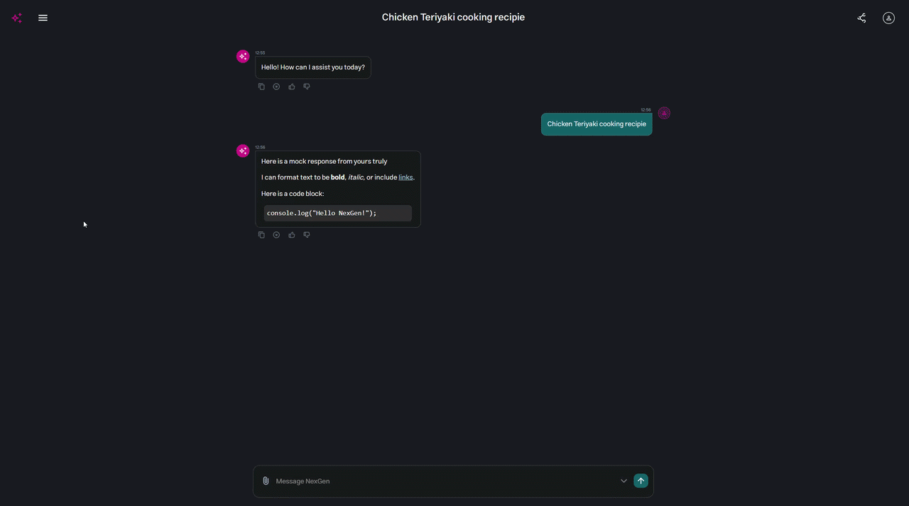
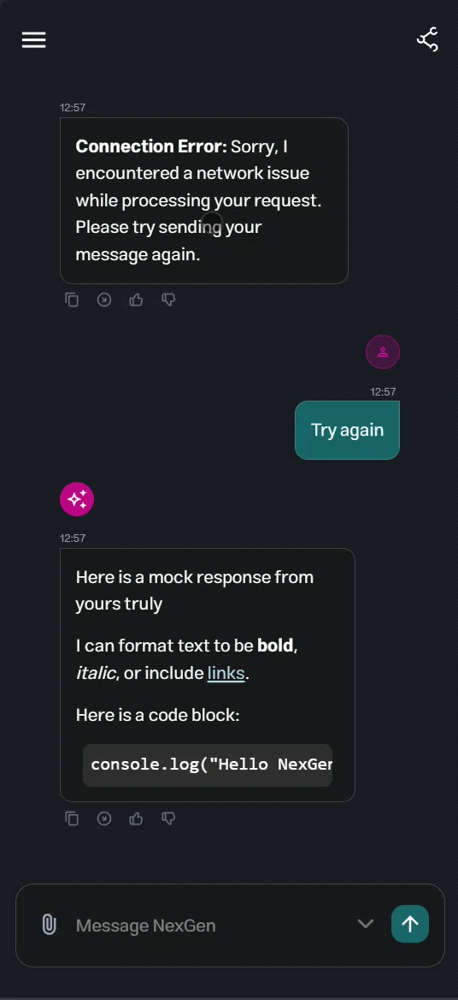

# NexGenUI

<div align="center">
  <table>
    <tr>
      <td align="center"><b>Desktop View</b></td>
      <td align="center"><b>Mobile View</b></td>
    </tr>
    <tr>
      <td>
        
      </td>
      <td></td>
    </tr>
  </table>
</div>

> A fully-featured and responsive AI/LLM chat interface built with React, Sass, GSAP and Typescript. Supports streaming responses, multi-sessions, markdown rendering, and persistent chat history (using local storage).

---

## Live Demo

The project is currently deployed on Vercel, and can be accessed at [this link](https://ai-interface-cyan.vercel.app).

## Table of Contents

- [Features](#features)
- [Tech Stack](#tech-stack-and-system-design)
- [Project Structure](#project-structure)
- [Getting Started Locally](#getting-started-locally)
- [Usage](#usage)
- [Important Logic Elements](#important-logic-elements)
- [Component Overview](#component-overview)
- [Bonus Features and Accessibility](#bonus-features-and-accessibility)
- [Challenges and Future Improvements](#challenges-and-future-improvements)
- [Author](#author)

---

## Features

### Overall completeness

- Implemented all the requirements given in the task document, plus bonus ones (check the [Bonus Features and Accessibility](#bonus-features-and-accessibility) section for more details).
- Mobile-first responsive design.
- Clean, modular codebase with reusable components.
- Simulated API interactions with realistic delays and error handling.
- Feedback from both technical and non-technical users incorporated into the design and functionality.

### Chat UI

- Chat message list, with different designs for user / AI.
- Scrollable chat history (includes an automatic scrolling down mechanism that takes effect when the user sends & receives a message).
- Animated sidebar for chat session management.

### Message Handling

- Messages stored and managed via React state.
- Markdown rendering for AI responses, including:
  - `` ` `` Code blocks
  - **Bold** / *italic* formatting
  - Clickable [links](https://example.com)
  - with `react-markdown`
- Typing indicator animation while AI is generating a response.

### Streaming Responses

- Simulated delay => AI responses displayed word-by-word.

### Chat Persistence

- Full chat history saved to `localStorage`.
- History restored automatically on page refresh, with a new chat session created for the user if the most recent session has already been used.

### Chat Sessions

- Easy switching between sessions by Sidebar.
- You can rename chat sessions to your liking.
- Sends user messages to a mock AI API, which responds with a simulated delay and a streaming response.

### Message Actions

- Copy to clipboard (fully functional).
- Regenerate response (simulated).
- Like / Dislike (simulated).

### Error Handling

- Simulated random errors using the `Math.random()` function.
- Empty submissions not allowed.
- Timeout feature to prevent spamming from the user.

### UI/UX

- Mock [Figma](https://www.figma.com/design/jIxHP4AxvGLOZSusqTYNpN/AI-Interface?m=auto&t=QJ3Bfjs8F4GLLXf3-1).
- Fully responsive layout, with basic accesibility features.
- Adapted design based on user feedback from both technical and non-technical users.

---

## Tech Stack and System Design

Followed [Sass](https://medium.com/@diyorbekjuraev77be-a-master-at-creating-the-7-1-sass-pattern-776fdfb5a3b1) and [TypeScript](https://www.typescriptlang.org/) guidelines (see [project structure](#project-structure)).

- Framework: `React`
- Build Tool: `Vite`
- Language: `Typescript`
- Styling: `Sass`
- Animation: `GSAP`
- Markdown Rendering: `React Markdown`
- Runtime: `Node.js`

---

## Project Structure

### Frontend

```bash
├── src/
│ ├── app/
│ │ └── App.tsx
│ │
│ ├── assets/ # icons and gifs
│ │ └── icons/
│ │
│ ├── components/ # common components
│ │ ├── button/
│ │ ├── dropdown/
│ │ ├── modelMessageContainer/
│ │ └── userMessageContainer/
│ │
│ ├── features/ # pages and different features
│ │ └── page/ # main page
│ │
│ ├── layouts/ # base, commonly used components
│ │ ├── chat/
│ │ ├── header/
│ │ ├── input/
│ │ └── sidebar/
│ │
│ ├── styles/ # sass 7:1 adapted
│ │ ├── abstracts/
│ │ ├── base/
│ │ ├── layouts/
│ │ └── main.scss
│ │
│ ├── types/ # typescript types
│ │ ├── chatTypes.ts
│ │
│ └── main.tsx 
│
├── .eslintrc.cjs
├── index.html
├── package.json
├── tsconfig.json 
└── vite.config.ts
```

---

## Getting Started Locally

### Prerequisites

- Node.js >= v20.19.5

### Installation & Setup

1) Clone the repo:

```bash
git clone https://github.com/cosminbrn/AI-Interface.git
cd AI-Interface
```

2) Install dependencies

```bash
cd frontend
npm i
```

3) Run local server

```bash
npm run dev
```

4) The app will be available at `http://localhost:5173`.

### Build for Production

```bash
npm run build
```

---

## Usage

1. Type a message in the input box at the bottom.
2. Press Enter or click Send to submit.
3. The AI response will stream in word-by-word.
4. Approximately 25% of responses will simulate a network error.
5. Use the sidebar to switch between chat sessions or start a new one.
6. Rename a session by clicking its title.
7. Hover an AI message to access Copy, Regenerate, or Like/Dislike actions.

---

## Important Logic Elements

- `handleNewChat()`: Creates new chat session with new ID based on the current date.
- `handleSendMessage()`: Handles the creation and addition of the freshly sent user message to the current session. Using `setTimeout()`, we imitate network problems, but also session delays => word-by-word messages from the LLM.
- `handleRenameChat()`: Handles session renaming.

## Component Overview

| Component | Responsibility |
| --- | --- |
| `Button` | Sidebar layout; creates a new chat session |
| `Dropdown` | Header layout; dropdown button that is supposed to change the LLM version |
| `modelMessage` | Component family; together, they create the styling and logic for the LLM messages |
| `userMessage` | Component family; together, they create and style the user given messages |
| `Page` | The powerhouse of this cell, hosts most of the project's logic, see [above](#important-logic-elements) |
| `Chat` | Supports all the messages in the current session; smart styling inspired by the look of Google Gemini interface (message centering) |
| `Header` | Responsive Header; supports LLM simulated version change and sidebar opening |
| `Input` | Input box, doesn't permit empty submissions |
| `Sidebar` | Animated sidebar, interface to previous chat sessions |

## Bonus Features and Accessibility

- Everytime the user sends a message, there's a 25% chance to get a simulated network error message from the LLM. This is implemented using `Math.random()` in the `handleSendMessage()` function in `Page.tsx`.
- Implemented initialization logic on mount to automatically create a fresh chat session if the most recent session has already been used.
- Use `dvh` units and `env(safe-area-inset-*)` to make the app look good on mobile devices, even with notches and dynamic toolbars.
- Mobile-first approach and responsive.
- Used semantic HTML elements, ARIA attributes, and keyboard navigability optimizations.

## Challenges and Future Improvements

- One of the main challenges was designing the layout. I wanted to make sure the interface is intuitive and easy to use, as well as being visually appealing and common (inspired by other industry standard interfaces), so that users can easily interact with it. I started with a mock Figma design, but the design adapted multiple times based on repeated user feedback rounds from both technical and non-technical users.
- Choosing the right project structure is a crucial step for me. I wanted to make sure the codebase is clean, modular, and scalable, while also being easy for me, as a developer, to put my ideas into practice. I chose to follow the Sass 7:1 pattern for styling, a pattern I have used before, together with a feature-based structure for the components, which I find to be the most intuitive and scalable way to organize a React project.
- The Virtual Keyboard Viewport Shift on mobile browsers was pushing the fixed layout off-screen, hiding the header and disrupting the chat experience. I used a different combination of `dvh` and `env(safe-area-inset-*)` units to make sure the app looks good on mobile devices, as well as a mobile-first approach to the styling. The Vercel deployment allowed me to recieve feedback from real users on different mobile devices.
- Integrating GSAP animations with React's state-driven DOM updates caused conflicts, specifically with the sidebar's exit animation instantly disappearing when the state changed. I had to try out different approaches to make sure the animations are smooth and performant, while avoiding React's DOM manipulation problems.
- For future improvements, I would like to implement real API integration with a backend server and an actual LLM, as well as user authentication and database storage for chat sessions. Also, I would like to add more message actions, such as message editing and deletion, and maybe a "share chat" feature that allows users to share their conversations with others, while finished up the functionality of the already implemented ones.

---

## Author

### Cosmin-George Baroana

- [GitHub](https://github.com/cosminbrn)
- [Email](mailto:cosminbaroana06@gmail.com)